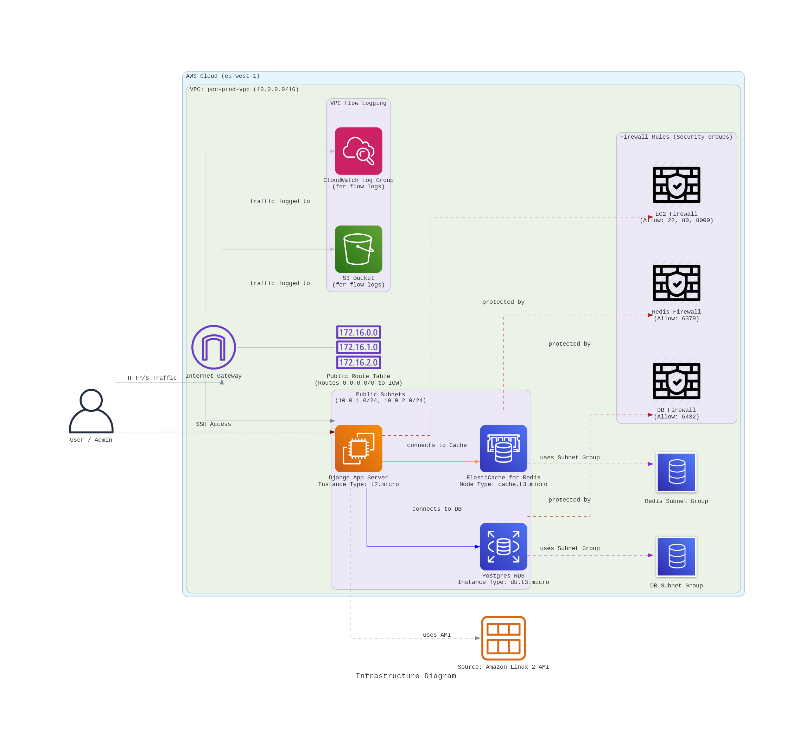

# Quick Connect: 

AWS Infrastructure with Terraform This repository contains the Terraform code to provision a complete and scalable AWS infrastructure for **Quick Connect**, a seamless and real-tme chat application. The infrastructure is designed to be fully automated, secure, and ready for production environments. 

**[Quick Connect](https://github.com/taha2samy/QuickConnect.git)** is an application that allows you to create chat rooms instantly from anywhere and connect with anyone. It's simple, fast, and designed to give users a quick and seamless communication experience.



This repository contains the Terraform code to provision a complete and scalable infrastructure for a Django application on AWS. The infrastructure is designed to be managed across multiple environments (e.g., `pre-prod`, `prod`) using a modular and reusable approach.

## Project Structure

The project follows a standard Terraform layout to separate environments, modules, and global resources.

```
.
├── env
│   ├── backend-config.hcl   # Generated file for remote state config
│   ├── global/              # For creating shared resources (S3, DynamoDB)
│   ├── pre-prod/            # Pre-production environment configuration
│   ├── prod/                # Production environment configuration
│   └── scripts/             # Shell scripts and templates (e.g., user-data)
└── modules/                 # Reusable Terraform modules
    ├── ami/
    ├── compute/
    ├── db/
    ├── key-pair/
    ├── logging/
    ├── network/
    └── redis/
```

-   **`modules/`**: Contains reusable modules for creating specific parts of the infrastructure like the network (VPC, subnets), database (RDS), compute (EC2, Auto Scaling), etc.
-   **`env/`**: Contains the configuration for each specific environment.
    -   **`global/`**: This is a special environment responsible for creating the foundational resources required for Terraform's remote state management (S3 bucket for state files and a DynamoDB table for state locking). **This must be run first.**
    -   **`pre-prod/` & `prod/`**: These directories define the infrastructure for their respective environments by calling the shared modules.

## Prerequisites

Before you begin, ensure you have the following installed:
*   [Terraform](https://learn.hashicorp.com/tutorials/terraform/install-cli) (v1.0.0 or newer)
*   [AWS CLI](https://aws.amazon.com/cli/)

---

### **IMPORTANT: Configuring AWS Credentials**

Terraform needs permissions to create and manage resources in your AWS account. You must configure your AWS credentials before running any Terraform commands.

#### For Local Development

The recommended way to configure credentials for local use is to use the AWS CLI.

1.  Run the configure command:
    ```bash
    aws configure
    ```
2.  You will be prompted to enter your credentials. **It is highly recommended to use an IAM User with a specific set of permissions, not your root account.**
    ```
    AWS Access Key ID [None]: YOUR_ACCESS_KEY
    AWS Secret Access Key [None]: YOUR_SECRET_KEY
    Default region name [None]: us-east-1  # Or your preferred region
    Default output format [None]: json
    ```
    Terraform will automatically find and use these credentials.

#### For GitHub Actions

**Do NOT store your `AWS_ACCESS_KEY_ID` or `AWS_SECRET_ACCESS_KEY` directly in your code or GitHub Actions workflow files.**

You must use **GitHub Encrypted Secrets**.

1.  In your GitHub repository, go to `Settings` > `Secrets and variables` > `Actions`.
2.  Click `New repository secret`.
3.  Create the following secrets:
    *   `AWS_ACCESS_KEY_ID`: Paste your AWS Access Key ID here.
    *   `AWS_SECRET_ACCESS_KEY`: Paste your AWS Secret Access Key here.
4.  The GitHub Actions workflow in this repository (`.github/workflows/`) is already configured to use these secrets to authenticate with AWS securely during the CI/CD process.

---

## Deployment Steps

The deployment process is designed to be sequential and safe. You **must** start with the `global` environment to set up the backend before deploying any other environment.

### Step 1: Create the Terraform Backend (One-Time Setup)

The remote backend is where Terraform stores the state of your infrastructure. This is crucial for team collaboration and for running Terraform in automated pipelines.

1.  Navigate to the `global` environment directory:
    ```bash
    cd env/global
    ```

2.  Initialize Terraform.
    ```bash
    terraform init
    ```

3.  Apply the configuration to create the backend resources.
    ```bash
    terraform apply
    ```
    After this step, a file named `backend-config.hcl` will be generated in the parent `env/` directory. This file contains the names of the S3 bucket and DynamoDB table that were just created. **Do not delete this file.**

    > **Note:** If `backend-config.hcl` is missing, you must re-run `terraform apply` in `env/global` to regenerate it.

### Step 2: Deploy an Environment (e.g., `prod`)

Once the backend is configured, you can deploy any environment.

1.  Navigate to the environment directory:
    ```bash
    cd env/prod
    ```

2.  Initialize Terraform for this environment, linking it to the remote backend.
    ```bash
    terraform init -backend-config="../backend-config.hcl"
    ```

3.  (Optional) Plan your changes.
    ```bash
    terraform plan
    ```

4.  Apply the configuration to deploy the infrastructure.
    ```bash
    terraform apply
    ```

### Step 3: Accessing the EC2 Instance via SSH

After a successful `terraform apply`, the private key required to access the EC2 instances will be available as a sensitive output.

1.  **Extract the Private Key:**
    Run the following command to save the private key to a local file.
    ```bash
    terraform output -raw ec2_private_key_pem > ~/.ssh/prod-key.pem
    ```

2.  **Set Correct Permissions:**
    SSH requires your private key file to be protected.
    ```bash
    chmod 400 ~/.ssh/prod-key.pem
    ```

3.  **Find the Public IP of an Instance:**
    Get the public IP address from the Terraform output.
    ```bash
    terraform output instance_public_ip
    ```

4.  **Connect to the Instance:**
    Use the key file to connect as the `ec2-user`.
    ```bash
    ssh -i ~/.ssh/prod-key.pem ec2-user@<your-instance-public-ip>
    ```
    Replace `<your-instance-public-ip>` with the actual public IP address.

---

## GitHub Actions CI/CD

This repository is configured to use GitHub Actions to automate the `plan` and `apply` process. The workflow is triggered on a push or merge to specific branches (e.g., `main` for production).

The workflow will securely use the `AWS_ACCESS_KEY_ID` and `AWS_SECRET_ACCESS_KEY` secrets you configured in the repository settings to authenticate with AWS.